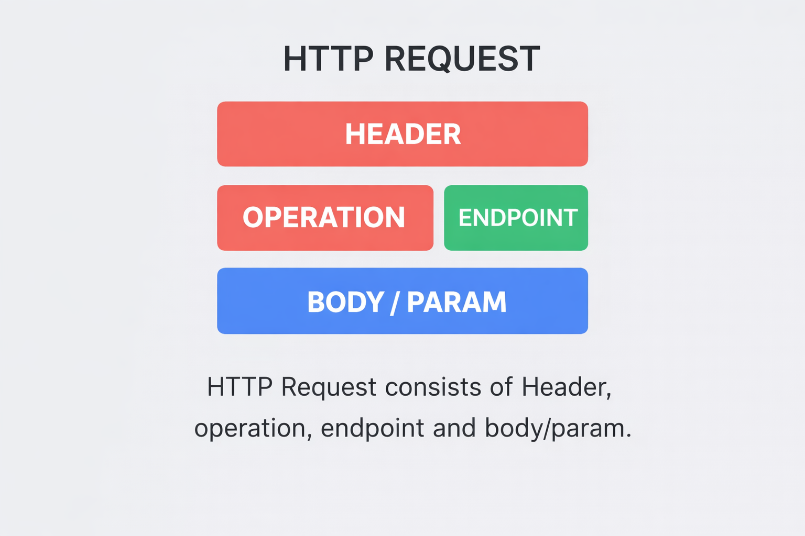

### HTTP Request

[Mozilla HTTP - Messages](https://developer.mozilla.org/en-US/docs/Web/HTTP/Guides/Messages)

An HTTP request consists of:
-   Operation (HTTP Method)
-   Endpoint (URL)
-   Headers (API Key, Authentication data, Content Type, etc.)
-   Parameter/Body

#### HTTP Methods

1.  GET:
    -   What it does: GET is used to request data from a web server. It's like asking for information.
    -   Idempotent: Yes, it's idempotent. Repeating a GET request won't change the server's state or the retrieved data.
    -   Safe: Yes, it's safe. A GET request doesn't modify any server resources; it's read-only.
2.  POST:
    -   What it does: POST is used to submit data to be processed to a specified resource. It's like submitting a form.
    -   Idempotent: No, it's not idempotent. Repeating a POST request may result in different actions or changes on the server.
    -   Safe: No, it's not safe. POST requests can altar server resources, so they are not considered safe for read-only operations.
3.  PUT:
    -   What it does: PUT is used to update or create a resource at a specific location. It's like saying, "Replace this with that."
    -   Idempotent: Yes, it's idempotent. Repeated PUT requests with the same data will result in the same resource state.
    -   Safe: No, it's not safe. PUT requests modify server resources, so they are not safe for read-only operations.
4.  DELETE:
    -   What it does: DELETE is used to remove a resource from the server. It's like saying, "Remove this."
    -   Idempotent: Yes, it's idempotent. Repeating a DELETE request for the same resource won't change the resource's absence.
    -   Safe: No, it's not safe. DELETE requests, by definition, modify server resources by deleting them.

    
For more information refer to the link: [https://www.w3schools.com/tags/ref_httpmethods.asp](https://www.w3schools.com/tags/ref_httpmethods.asp)

---

#### HTTP Headers

1.  Content-Type:
    -   What it does: Content-Type is used to specify the type of data being sent to the server.
    -   Example: Content-Type: application/json
    -   Example: Authorization: Bearer <token>
2.  Accept:
    -   What it does: Accept is used to specify the type of data that the server is able to send back.
    -   Example: Accept: application/json

#### HTTP Response

An HTTP response consists of: 
-   Status information (succeeded or failed request)
-   Headers (Info on how to handle the response.)
-   Body (Text, **JSON**, HTML, File/Image, etc.)

---

